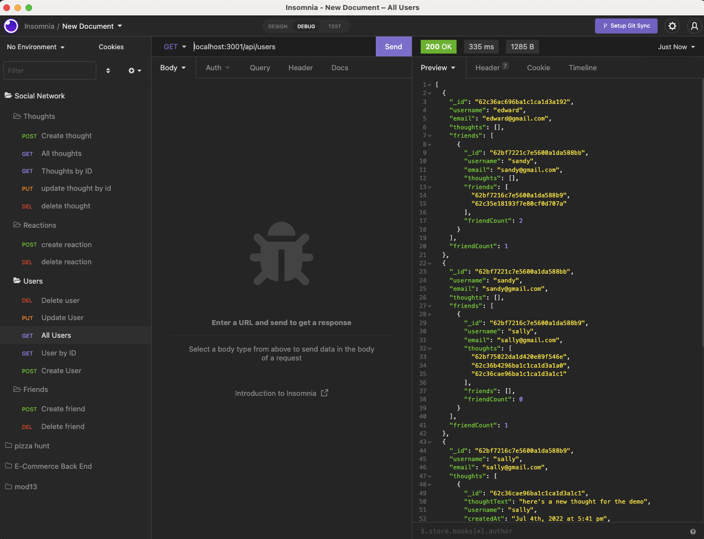

# Social Network API

Social Network API is a web application where users can share their thoughts, react to friends’ thoughts, and create a friend list. It uses Express.js for routing, a MongoDB database, and the Mongoose ODM.

# Table of Contents

- [Installation](#installation)
- [Usage](#usage)
- [License](#license)
- [Contribute](#contribute)
- [Questions](#questions)
- [Github Profile](#github)

## Installation

- Install node.js
- download the repo: https://github.com/bagl0025/social-network-api.git
- The dependencies can be installed by running `npm install`

- Run the application using `npm start` or `node server`

## Usage

There is no front end for this application so you should use Insomnia, Postman, or an API client of your choice to test the routes and functionality.

Using an API client you can view, create, edit, and delete items. A video link (below) shows the full functionality using Insomnia. A snapshot of the Insomnia window (below) shows all of the API routes that will be demonstrated in the video.

### Social Network API routes in Insomnia

### Link to demo video

This video loads from Google Drive. It can be downloaded from the Github repo's assets folder.

[Demo Video](https://drive.google.com/file/d/1D3z1jBURAAY6tHHgS-I5y6GS5bDa2YYW/view?usp=sharing)

## License

This software is under the [MIT](./LICENSE) license.

## Contribute

Refer to [Contributor Covenant](https://www.contributor-covenant.org/) for contribution guidelines.

## Questions

Contact author at bagley@umn.edu for questions or to report issues.

## GitHub

https://github.com/bagl0025/social-network-api.git
